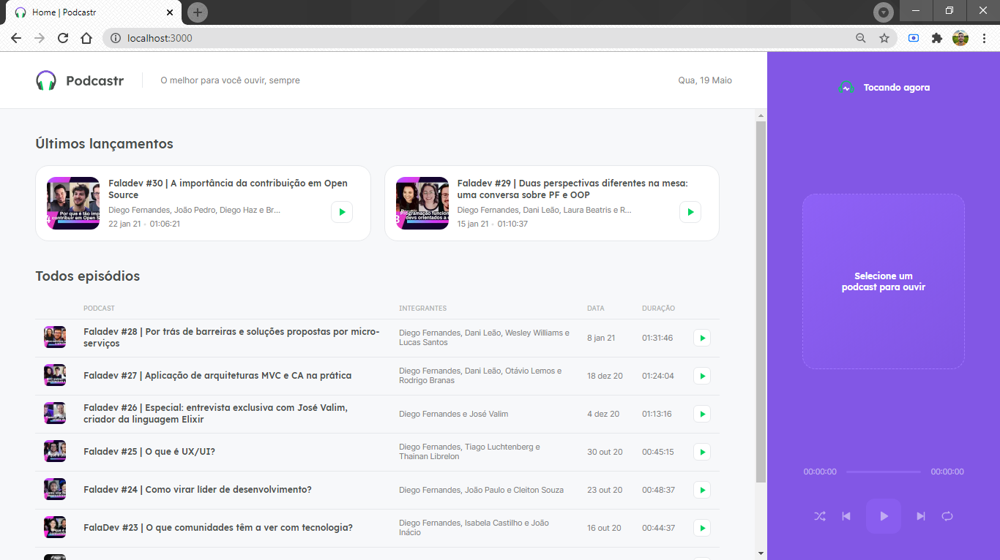
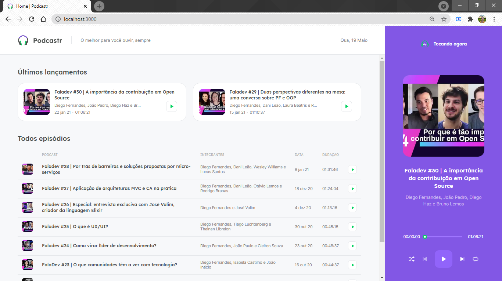

# Projeto NLW 5° :clipboard:  

Projeto Podcastr com Next.js - NLW 5° edição

# Sobre o Projeto - Podcastr :pencil:

Este projeto é um podcast, a aplicação conta com uma pagina inicial, com um player e uma lista de podcast, o player contém todas as funcionalidades, embaralhar episódios aleatórios, próximo e anterior, repetir episódio, play e pause. Todas as funcionalidades de um player comum.

Também contém uma página que mostra a descrição de um episódio, assim podendo ouvi-lo nessa mesma página, essa página também contém o player, mas somente toca o episódio selecionado.

## Layout 

<h3>Página principal do Podcast</h3>

Nesta imagem podemos ver o layout da aplicação do Podcast.

<h3>Podcast com Player ativo</h3>

Nesta imagem podemos ver o player do podcast com um episódio tocando.

## Tecnologias :wrench:

- Typescript 
- Javascript
- SASS
- Axios
- Next.js
- React Hooks
